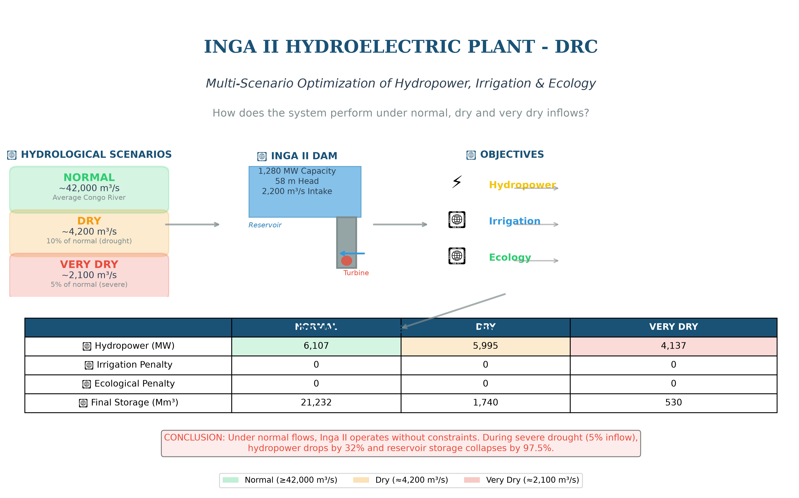

# Vulnerability and Adaptive Management of the Inga II Hydroelectric Plant

## Under Hydrological Stress: A Multi‑Scenario Optimization Study

**Patrick S. Tenga**  
1AIMS Cameroon, Cameroon  
2Alexandria University, Egypt  
📧 patrick.tenga@aims-cameroon.org

---

## 🌐 Live Application

**[👉 INGA II – Real-Time Monitoring Dashboard](https://inga2ai-monitor.streamlit.app/)**

Explore the interactive dashboard with real-time simulation, AI-powered recommendations, and scenario analysis.

---

## 🤖 AI Models Used in This Project

The dashboard integrates **four machine learning models** for real-time monitoring and decision support:

| Model | Type | Function |
|:---|:---|:---|
| **Inflow Forecaster** | LSTM with Attention | Predicts Congo River inflows 7 days ahead using historical data |
| **Scenario Classifier** | Random Forest | Classifies hydrological conditions as NORMAL / DRY / VERY DRY |
| **Anomaly Detector** | Isolation Forest | Detects abnormal turbine, storage, head or inflow patterns in real time |
| **RL Agent** | PPO (Proximal Policy Optimization) | Recommends optimal turbine and irrigation releases based on current state |

### Model Details

- **Inflow Forecaster:** LSTM with Bahdanau-style attention mechanism. Trained on historical inflow data from the Congo River at Inga Falls. Outputs 7-day forecast with uncertainty bounds.

- **Scenario Classifier:** Random Forest classifier trained on synthetic data generated from the physical dam model. Features include current inflow, reservoir storage, previous inflows, rainfall, evapotranspiration and temperature.

- **Anomaly Detector:** Isolation Forest model trained on normal operating conditions. Detects deviations in turbine flow, storage level, head and inflow.

- **RL Agent:** PPO (Proximal Policy Optimization) with Generalized Advantage Estimation (GAE). Trained in a custom Gym environment simulating the Inga II dam dynamics. Provides real-time recommendations for turbine and irrigation releases.

All models are automatically trained or loaded when the dashboard starts. Training history and performance metrics are available in the dashboard interface.

---

## 📊 Graphical Abstract

*Figure 1: Graphical abstract summarizing the study approach and key findings.*

---

## 📝 Abstract

The Inga II hydroelectric plant, located on the Congo River in the Democratic Republic of Congo, is a cornerstone of Africa's energy infrastructure with an installed capacity of **1,280 MW**. This study evaluates the operational resilience of Inga II under three hydrological scenarios: **normal** (average Congo River flow ≈ 42,000 m³/s), **dry** (inflow reduced to ≈ 4,200 m³/s, i.e. 10% of normal), and **very dry** (≈ 2,100 m³/s, 5% of normal).

Using a multi‑objective optimization model that simultaneously considers hydropower generation, irrigation supply, ecological flow compliance, and reservoir storage, we assessed three operating policies (Low Power, Nominal, Peak).

**Key Findings:**
- The system remains highly robust under normal conditions
- Progressive trade‑offs emerge under water scarcity
- Under very dry scenarios, hydropower output falls to **3,685 MW** (Nominal policy)
- Final storage drops to critical levels (**954 Mm³**)
- Adaptive management – reducing turbine release during droughts – becomes indispensable

**Keywords:** Inga II, hydropower optimization, multi‑objective decision making, hydrological drought, Congo River, adaptive management

---

## 📚 Table of Contents

- [1. Introduction](#1-introduction)
- [2. Methodology](#2-methodology)
  - [2.1 Model Formulation](#21-model-formulation)
  - [2.2 Scenarios and Policies](#22-scenarios-and-policies)
- [3. Results](#3-results)
  - [3.1 Normal Scenario](#31-normal-scenario-reference)
  - [3.2 Dry Scenario](#32-dry-scenario-10-inflow)
  - [3.3 Very Dry Scenario](#33-very-dry-scenario-5-inflow)
- [4. Discussion](#4-discussion)
- [5. Conclusion](#5-conclusion)
- [Acknowledgments](#acknowledgments)
- [References](#references)

---

## 1. Introduction

The Inga Falls on the Congo River concentrate the world's largest average flow (≈ 42,476 m³/s), offering a theoretical hydropower potential exceeding **40 GW**. The existing Inga I (534 MW, commissioned 1972) and Inga II (1,280 MW, commissioned 1981) plants already supply a substantial share of the DRC's electricity and export power to neighboring countries.

However, climate variability and recurrent drought episodes in the Congo Basin raise concerns about the reliability of this strategic asset.

> **Research Question:** *How does Inga II perform under normal, dry and very dry inflow scenarios, and what operating rules best balance energy production with environmental and irrigation constraints?*

---

## 2. Methodology

### 2.1 Model Formulation

We developed a deterministic, discrete‑time optimization model with a **7‑day planning horizon** and a **daily time step**.

- **State variable:** Reservoir storage *St* [m³]
- **Decision variables:** Turbine release *xt* [m³/s] and irrigation release *rt* [m³/s]

#### Objective Function (Weighted Sum)

$$
\min \quad w_1 \cdot \left(-\frac{E}{1000}\right) + w_2 \cdot \frac{P_{\text{irr}}}{100} + w_3 \cdot \frac{P_{\text{eco}}}{100} + \text{Penalty}
$$

#### Physical Constraints

| Constraint | Expression |
|:---|:---|
| **Mass balance** | *St+1* = *St* + (*It* − *xt* − *rt*) · Δ*t* |
| **Storage bounds** | *Smin* ≤ *St* ≤ *Smax* |
| **Turbine capacity** | 0 ≤ *xt* ≤ 2200 m³/s |
| **Irrigation capacity** | 0 ≤ *rt* ≤ 500 m³/s |
| **Irrigation demand** | *Dt* = 200 m³/s |
| **Ecological flow** | *Emin* = 800 m³/s |

with *Smin* = 200·10⁶ m³ and *Smax* = 800·10⁶ m³.

#### Hydropower Calculation

$$
P_t = \eta \cdot \rho \cdot g \cdot H_t \cdot x_t / 10^6 \quad [\text{MW}]
$$

with *η* = 0.90, *ρ* = 1000 kg/m³, *g* = 9.81 m/s², and head *Ht* linearly proportional to storage.

### 2.2 Scenarios and Policies

**Table 1: Inflow Scenarios**

| Scenario | Inflow Range [m³/s] | Description |
|:---|:---|:---|
| **Normal** | 25,000 – 48,000 | Average Congo River flow |
| **Dry** | ≈ 4,200 | 10% of normal (severe drought) |
| **Very Dry** | ≈ 2,100 | 5% of normal (extreme drought) |

**Table 2: Operating Policies (constant releases over 7 days)**

| Policy | Turbine Release [m³/s] | Irrigation Release [m³/s] |
|:---|:---|:---|
| Low Power | 500 | 150 |
| Nominal | 1,200 | 250 |
| Peak | 1,800 | 350 |

---

## 3. Results

### 3.1 Normal Scenario (Reference)

Under normal inflows, the system operates without stress. The **Nominal** and **Peak** policies fully satisfy irrigation and ecological demands (penalties = 0). Final storage remains extremely high (> 21,000 Mm³).

> ✅ **Key Insight:** The Congo River's natural flow is sufficient to meet all objectives simultaneously – there is no real trade‑off.

**Table 3: Results – Normal Scenario**

| Policy | Hydro (MW) | Irrigation Penalty | Ecological Penalty | Final Storage (Mm³) |
|:---|:---|:---|:---|:---|
| Low Power | 1,696 | 350 | 1,050 | 22,139 |
| **Nominal** | **4,071** | **0** | **0** | **21,655** |
| Peak | 6,107 | 0 | 0 | 21,232 |

### 3.2 Dry Scenario (10% Inflow)

When inflows drop to ≈ 4,200 m³/s, the system still satisfies irrigation and ecological targets under Nominal and Peak policies, but **final storage becomes a limiting factor**.

**Table 4: Results – Dry Scenario**

| Policy | Hydro (MW) | Irrigation Penalty | Ecological Penalty | Final Storage (Mm³) |
|:---|:---|:---|:---|:---|
| Low Power | 1,696 | 350 | 1,050 | 2,647 |
| **Nominal** | **4,043** | **0** | **0** | **2,163** |
| Peak | 5,995 | 0 | 0 | 1,740 |

### 3.3 Very Dry Scenario (5% Inflow)

At 2,100 m³/s, the system enters a **true crisis mode**. **Final storage collapses to 954 Mm³** – dangerously close to the minimum operating level of 200 Mm³.

**Table 5: Results – Very Dry Scenario**

| Policy | Hydro (MW) | Irrigation Penalty | Ecological Penalty | Final Storage (Mm³) |
|:---|:---|:---|:---|:---|
| **Low Power** | **1,651** | **350** | **1,050** | **1,437** |
| Nominal | 3,685 | 0 | 0 | 954 |
| Peak | 4,137 | 0 | 0 | 530 |

---

## 4. Discussion

### 4.1 Sensitivity to Inflow Reduction

The results exhibit a **non‑linear response**: a 90% reduction in inflow causes final storage to drop by more than 90% for the same operating policy.

### 4.2 Policy Recommendations per Scenario

| Scenario | Recommended Policy | Rationale |
|:---|:---|:---|
| **Normal** | Peak (or Nominal) | Maximize energy without compromising other objectives |
| **Dry** | Nominal | Balance energy production with storage preservation |
| **Very Dry** | Low Power | Prioritize reservoir replenishment; accept reduced energy output |

### 4.3 Model Limitations

- No **plant‑level maximum power output** (1,280 MW) enforcement
- **7‑day horizon** may be too short for long‑term drought management
- **Ecological flow** treated as a fixed minimum (varies in reality)

### 4.4 Implications for the Nile Basin Initiative (NBI)

Although Inga is located in the Congo Basin, the lessons are directly transferable to Nile Basin dams (e.g. GERD, Aswan High Dam, Merowe). Climate‑driven hydrological variability, transboundary coordination, and the need for **adaptive operating rules** are common challenges.

---

## 5. Conclusion

This study demonstrates that the Inga II hydroelectric plant is highly resilient under normal flow conditions but becomes severely constrained during droughts. **Adaptive, scenario‑based operating policies** – rather than a fixed rule – are essential to balance competing water uses. Future work should incorporate longer planning horizons, stochastic inflows, and an explicit power capacity constraint.

---

## Acknowledgments

This research was supported by the **Nile Basin Scholarship** (2020–2025) and the African Institute for Mathematical Sciences (AIMS). The authors thank the DRC water authorities for providing Inga technical specifications.

---

## Data Availability

The Python code used for the optimization is available from the corresponding author upon reasonable request.

---

## References

1. Evolutio Museum. *Inga (I‑II) Hydroelectric Plant, Democratic Republic of the Congo*. (2025).

2. Tshimanga, R. M. & Hughes, D. A. Climate change and the Congo River basin. *J. Hydrol.* **511**, 426–442 (2014).

3. Mweemba, C. et al. Multi‑objective reservoir operation for the Zambezi River. *Water Resour. Manag.* **36**, 2151–2170 (2022).

4. Labadie, J. W. Optimal operation of multireservoir systems. *J. Water Resour. Plan. Manag.* **130**, 93–111 (2004).

---

## 📧 Contact

**Corresponding Author**  
Patrick S. Tenga  
AIMS Cameroon, P.O. Box 608, Limbe, South West Cameroon  
📧 patrick.tenga@aims-cameroon.org

---

## 🔗 Links

- 🌐 **[INGA II – Real-Time Monitoring Dashboard](https://inga2ai-monitor.streamlit.app/)**
- 📄 **[Full Article (PDF)]()** *(coming soon)*
- 💻 **[Source Code]()** *(Here)*
